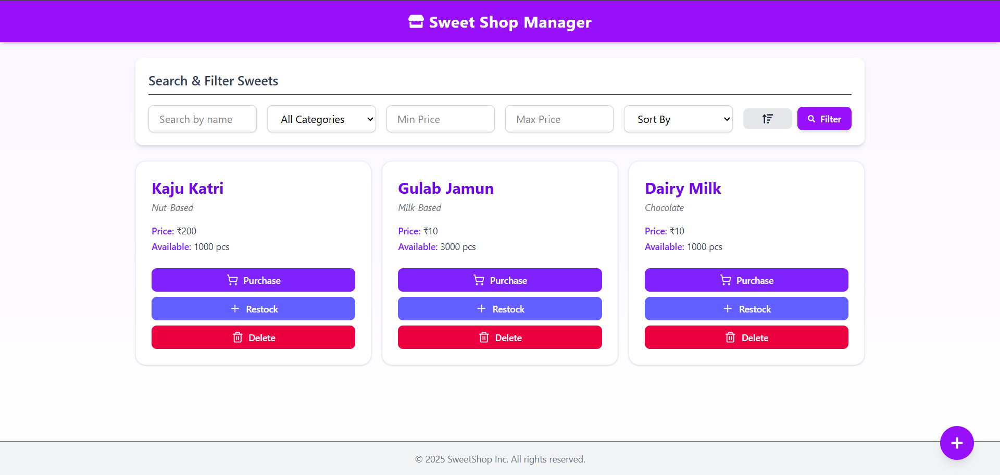
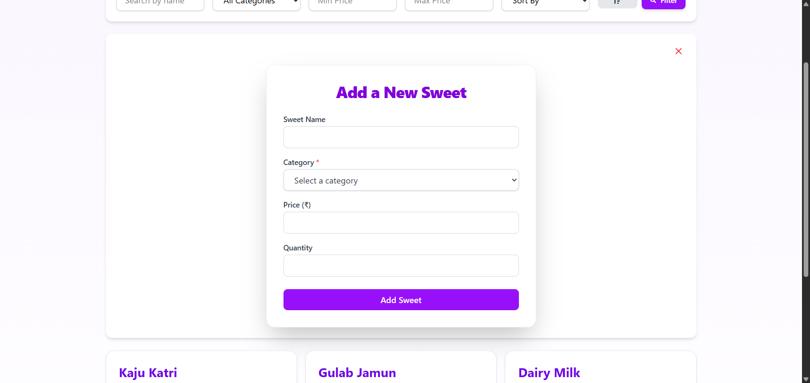
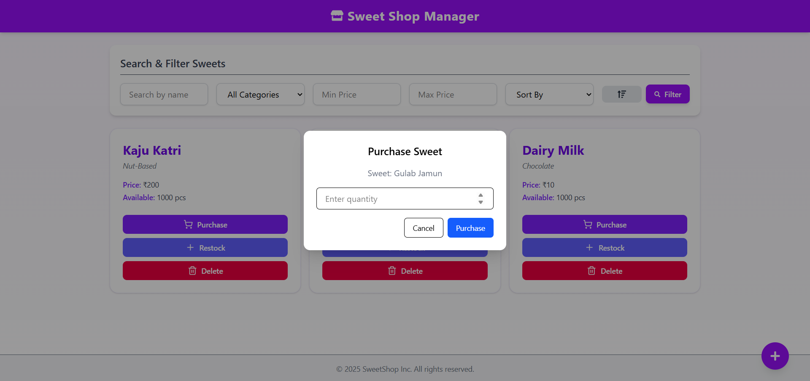

# 🍬 Sweet Shop Management System

A full-stack application built to streamline the management of sweets inventory. From adding and removing items to restocking and handling purchases, this system offers a smooth and responsive interface with powerful filtering and sorting options.

---

## ✨ Key Features

- ➕ Add new sweets to inventory
- 🗑️ Remove existing items
- ♻️ Restock quantities
- 🛒 Purchase sweets with quantity control
- 🔎 Search and filter sweets by name, category, price, and more
- 📊 Sort results by price, name, quantity, or category
- 🧠 Intuitive and responsive UI designed for usability
- ✅ Built entirely using **Test-Driven Development (TDD)**
- 🔍 Real-time updates with React hooks

---

## 🛠 Tech Stack Overview

| Component   | Technology                 |
|------------|-----------------------------|
| Frontend   | React.js, TailwindCSS       |
| Backend    | Node.js, Express.js         |
| Testing    | Jest                        |
| Icons      | React Icons, Lucide Icons   |
| Styling    | Tailwind CSS                |
| Architecture | RESTful API               |

---

## 🔧 Development Approach

| Aspect           | Details                                            |
|------------------|----------------------------------------------------|
| **Language**     | JavaScript (ES6+, Node.js)                         |
| **Testing**      | Fully covered with **Jest**                        |
| **Design**       | Clean, modular structure with component reusability|
| **TDD**          | Practiced throughout the development lifecycle     |
| **Git Strategy** | Clear, regular commits with semantic messages      |
| **AI Support**   | Used ChatGPT for idea suggestions and refinements

---

## 🚀 Getting Started

### 📁 Clone This Repository

```bash
git clone https://github.com/CODExJATIN/sweetshop-management-system.git
cd sweetshop-management-system
````

---

### 🖥 Frontend Setup (Client)

```bash
cd client
npm install
```

To start the development server:

```bash
npm start
```

> Frontend runs at `http://localhost:5173`.

---

### Backend Setup (Server)

```bash
cd server
npm install
```

Create a `.env` file in the `server` directory:

```env
PORT=5000
MONGO_URI=your_mongo_connection_string
CORS_ORIGIN=your_frontend_url
```

To start the backend:

```bash
npm run dev
```

> API server will be available at `http://localhost:5000`.

---

## 🧪 Testing & Coverage

This project adheres strictly to **Test-Driven Development** principles.

✔️ Tests were written **before** implementation began \
✔️ Each test covers unit and edge cases \
✔️ Ensures validation and logical correctness

### 📊 To check test coverage:

```bash
cd server
npm test -- --coverage
```

---

## 📸 Screenshots

### Dashboard View  


### Add Sweet Form  


### Purchase Sweet


### Restock Sweet


---

## 📄 License

This project was developed as an **educational demo** for the *Kata: Sweet Shop Management System* assignment.
It is not intended for production use.

---

## 🙏 Acknowledgements

Built as part of the **Kata : Sweet Shop Management System** created by **Incubyte**, this project demonstrates how clean code practices and TDD can be effectively applied using **React** and **Node.js**.

---

